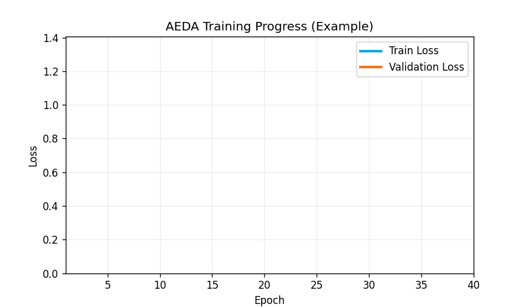
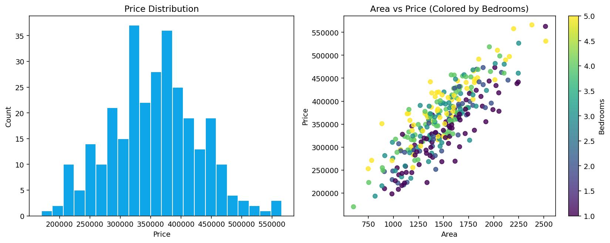
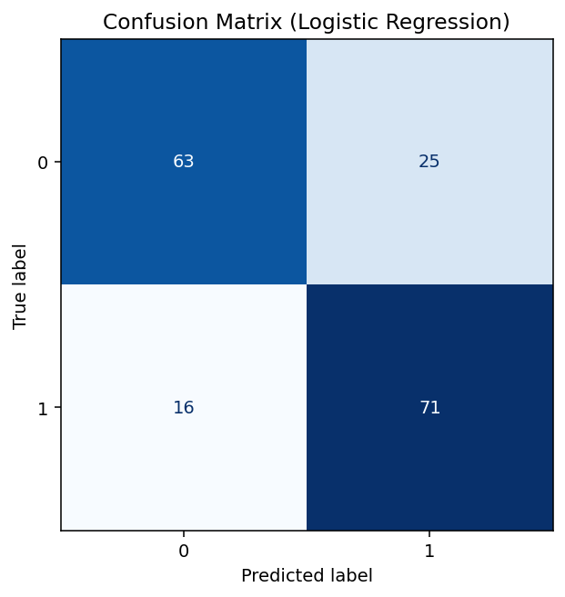
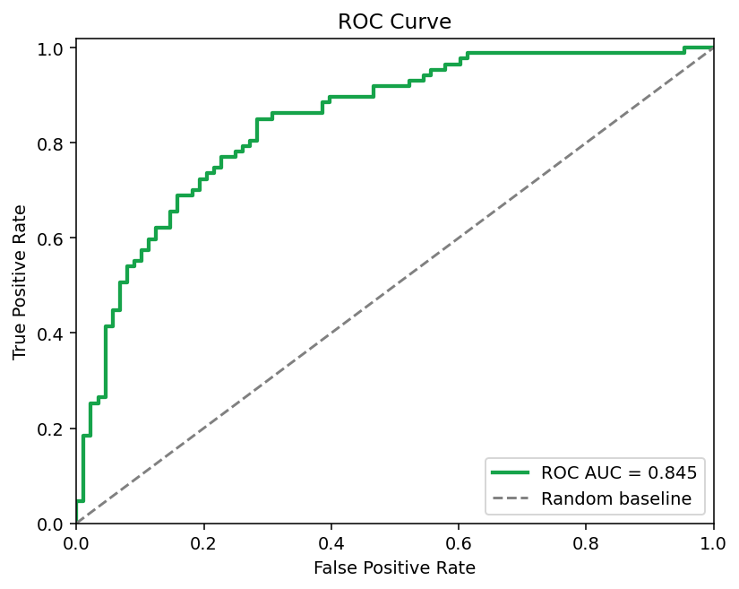
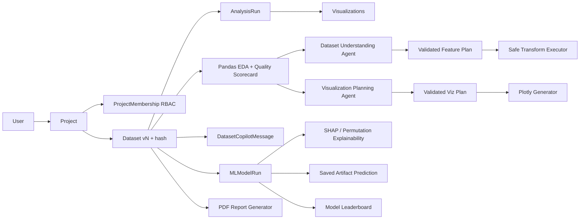

# AEDA (Automated EDA)

<p align="center">
  
</p>

<p align="center">
  <strong>AI-native, multi-tenant analytics platform for dataset understanding, automated insights, explainable ML, and interactive prediction.</strong>
</p>

<p align="center">
  
  
  
  
  
  
</p>

---

## What AEDA Solves

AEDA helps teams move from raw CSV/XLSX files to **trustworthy decisions** with:

- Automated EDA (schema, missingness, statistics, sample rows)
- LLM-guided feature planning and chart planning
- Safe, validated transformations (no LLM code execution)
- Multi-model training + explainability + leaderboard
- Interactive model prediction from saved trained runs
- Project-level collaboration with role-based access

---

## What Makes This Version Stand Out

### Production-style collaboration model
- **Project Membership + RBAC**:
  - `owner`: full access + member management
  - `analyst`: upload/analyze/train/predict
  - `viewer`: read-only access
- Folder-style Projects UI with member management and per-project dataset actions.

### AI + analytics blend
- **Dataset Copilot** chat for natural language questions.
- Copilot can return chart plans that render inline with Plotly.
- Summary-only context is sent to the LLM (not full dataset payload).

### Model governance features
- Dataset version + hash captured for lineage.
- Explainability in model results (SHAP, with fallback).
- Cross-run **Model Leaderboard** across metrics.
- One-click **PDF report** for stakeholders.

### Better UX quality
- Structured dataset overview tables (not raw dict dumps)
- Interactive confusion matrix + ROC plots
- Profile/settings page (username/email/name/password)
- Dark/Light mode toggle

---

## Live Product Flow

1. Create/open a project (folder-style).
2. Upload dataset to that project.
3. Auto analysis runs immediately:
   - schema + stats + quality scorecard
   - LLM feature plan + visual plan
   - safe transformation execution
4. Inspect insights and generated visualizations.
5. Train model (Linear/Logistic/RF/SVM) with configurable defaults.
6. Review explainability + leaderboard ranking.
7. Predict using any previously trained model run.
8. Export PDF report for the dataset.

---

## Example Outputs

### EDA Snapshot
<p align="center">
  
</p>

### Confusion Matrix (Interactive in app)
<p align="center">
  
</p>

### ROC Curve (Interactive in app)
<p align="center">
  
</p>

---

## Architecture (Current)



---

## Multi-Tenant + Access Model

```text
User
  -> Project (owner)
      -> ProjectMembership (owner/analyst/viewer)
      -> Dataset (versioned, hashed)
          -> AnalysisRun
              -> Visualization
          -> MLModelRun
          -> DatasetCopilotMessage
```

Access is enforced by project membership checks, not only owner checks.

---

## Core Feature Set

### Dataset and EDA
- CSV/XLSX upload
- Auto profile:
  - columns, dtypes
  - missing values
  - mean/median/std + summary stats
  - sample rows
- Data quality scorecard:
  - overall score
  - completeness %
  - duplicate row %
  - numeric outlier %
  - high-cardinality columns

### LLM Agent Layer
- LangChain + LangGraph orchestration
- Groq-backed model inference
- JSON contract validation before execution
- Fallback deterministic behavior if LLM is unavailable

### Visualizations
- Auto-generated Plotly charts
- Stored per dataset + analysis run
- Rendered interactively in UI

### ML + Explainability
- Models:
  - Linear Regression
  - Logistic Regression
  - Random Forest
  - SVM
- Optional tuning + configurable training defaults
- Metrics, confusion matrix, ROC/AUC
- Explainability:
  - SHAP global + local explanations
  - permutation fallback if SHAP unavailable

### Prediction
- Select dataset
- Select one trained model run from that dataset
- Input feature values
- Get prediction (+ probabilities if available)
- Legacy model-run artifact auto-rebuild supported

### Reporting and Comparison
- Model leaderboard (metric-driven ranking)
- PDF export with EDA/model summary and metadata

### UX and account
- User profile/settings page
- Update username/email/name
- Change password
- Dark/light mode toggle

---

## Repository Structure

```text
ai_analytics_app/
  config/
    settings.py
    urls.py
  users/
    models.py
    forms.py
    views.py
  projects/
    models.py              # Project, Dataset, ProjectMembership
    forms.py
    permissions.py         # Access helpers (viewer/analyst/owner)
    views.py
    urls.py
    templatetags/
  analytics_engine/
    models.py              # AnalysisRun, Visualization, MLModelRun, DatasetCopilotMessage
    forms.py
    views.py
    urls.py
    services/
      analysis_service.py
      agents.py
      copilot_service.py
      visualization_service.py
      ml_service.py
    utils/
      validators.py
      data_io.py
  templates/
    base.html
    users/
    projects/
    analytics_engine/
  static/
    css/main.css
    js/main.js
  docs/
    images/
    generate_example_assets.py
  requirements.txt
  .env.example
  manage.py
```

---

## Routes (Important)

### Auth + user
- `/register/`
- `/login/`
- `/logout/`
- `/profile/`

### Projects + datasets
- `/projects/`
- `/projects/<project_id>/`
- `/projects/datasets/`
- `/projects/datasets/upload/`
- `/projects/datasets/<dataset_id>/`

### Analytics
- `/analytics/insights/<dataset_id>/`
- `/analytics/visualizations/<dataset_id>/`
- `/analytics/copilot/<dataset_id>/`

### ML
- `/analytics/models/train/`
- `/analytics/models/results/<run_id>/`
- `/analytics/models/predict/`
- `/analytics/models/leaderboard/`

### Report
- `/analytics/reports/dataset/<dataset_id>/`

---

## Local Setup

### 1) Install dependencies

```bash
cd "d:\python backend\ai_analytics_app"
python -m pip install -r requirements.txt
```

### 2) Configure environment

```bash
copy .env.example .env
```

Set:

```env
DJANGO_SECRET_KEY=replace-with-secure-key
DJANGO_DEBUG=1
DJANGO_ALLOWED_HOSTS=127.0.0.1,localhost
GROQ_API_KEY=your_groq_api_key
GROQ_MODEL=llama-3.3-70b-versatile
```

### 3) Migrate and run

```bash
python manage.py migrate
python manage.py createsuperuser
python manage.py runserver
```

Open: `http://127.0.0.1:8000/`

---

## Security Notes

- LLM receives summary/sample context, not full raw dataset payload.
- LLM output is validated before any transformation/chart execution.
- No shell/file execution from LLM responses.
- Auth-protected routes with project-scoped access checks.
- CSRF-protected state-changing forms.

---

## Known MVP Boundaries

- SQLite is used for MVP simplicity.
- Long-running analysis/training is synchronous.
- Single-server filesystem storage for media/artifacts.

For production hardening, move to PostgreSQL + async workers + object storage.

---

## Re-generate README Demo Assets

```bash
python docs/generate_example_assets.py
```

Produces:
- `docs/images/eda_overview.png`
- `docs/images/confusion_matrix.png`
- `docs/images/roc_curve.png`
- `docs/images/training_animation.gif`

---

## License

MIT
